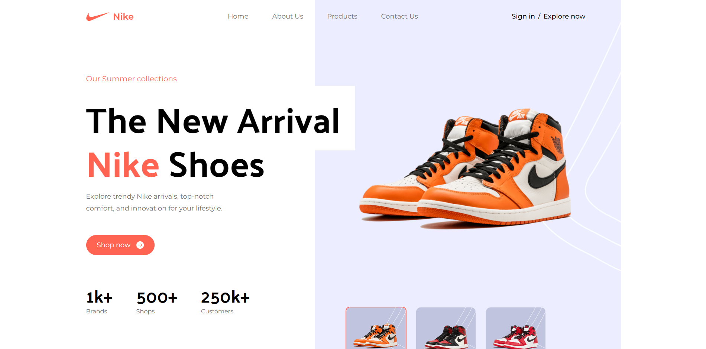

# Nike Shoe Collection Website

## Description
This project is a Nike shoe Landing Page website built using ReactJS, Tailwind CSS, and Vite. It showcases various Nike shoe products, customer reviews, special offers, and services.

## Features
- Responsive design for seamless viewing on different devices
- Hero section highlighting key features or promotions
- Display of popular Nike shoe products
- Highlight of super quality products
- Services section to showcase available services
- Special offers section for promotions or discounts
- Customer reviews section for testimonials
- Subscription option for users to stay updated
- Footer section with navigation links and contact information

## Follow
For support or inquiries, please contact me via:
- Email: inquery.saurav@gmail.com
- LinkedIn: [Saurav Chaturvedi](https://www.linkedin.com/in/isaurav/)

## Getting Started
Follow these steps to set up the project locally on your machine.

**Prerequisites**
Make sure you have the following installed on your machine:

- [Git](https://git-scm.com/)
- [Node.js](https://nodejs.org/en)
- [npm](https://www.npmjs.com/) (Node Package Manager)

**Cloning the Repository**

```bash
git clone https://github.com/sauravxcode/shoe-landing-page.git
cd shoe-landing-page
```

**Installation**

Install the project dependencies using npm:

```bash
npm install
```


**Running the Project**

```bash
npm run dev
```

Open [http://localhost:5173](http://localhost:5173) in your browser to view the project.


## Preview

